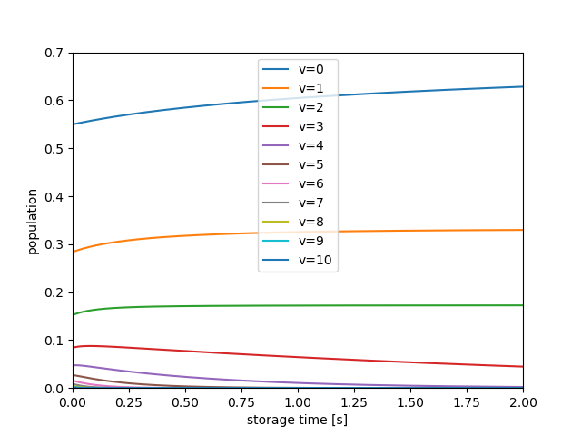
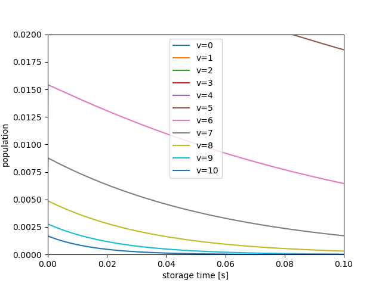

# Carbon Dimer Anion (C2-) cooling simulation: doublet X↔A

## Requirements
* [NumPy](https://numpy.org/)
* [SciPy](https://www.scipy.org/) >=1.0.0 for using scipy.integrate.solve_ivp
* [Matplotlib](https://matplotlib.org/)

* [LEVEL](http://scienide2.uwaterloo.ca/%7Erleroy/LEVEL16/) program
* [gfortran](https://gcc.gnu.org/fortran/) or [flang](https://llvm.org/)

## Installation
```
git clone https://github.com/harapekoaomushi/C2anion-molecular-cooling.git
```

## Common Useage

### 1. Download the LEVEL program

LEVEL16 can be downloaded at Prof. Robert J. Le Roy's website [http://scienide2.uwaterloo.ca/%7Erleroy/LEVEL16/](http://scienide2.uwaterloo.ca/%7Erleroy/LEVEL16/).

#### Manual of LEVEL
Le Roy, R. J. (2017). LEVEL: A computer program for solving the radial Schrödinger equation for bound and quasibound levels. Journal of Quantitative Spectroscopy and Radiative Transfer, 186, 167–178. [https://doi.org/10.1016/j.jqsrt.2016.05.028](https://doi.org/10.1016/j.jqsrt.2016.05.028)

Supplementary Material: [http://scienide2.uwaterloo.ca/~rleroy/LEVEL16/Appendices.pdf](Supplementary Material)


### 2. Build the LEVEL program by gfortran or flang.

```
gfortran codeLEVEL16.f -o a.out
```

### 3. Run the LEVEL program.

```
./run.sh
```


### 4. Calculate the population. (population.py)

```
python ./population.py
```

### Result



## License
MIT License
